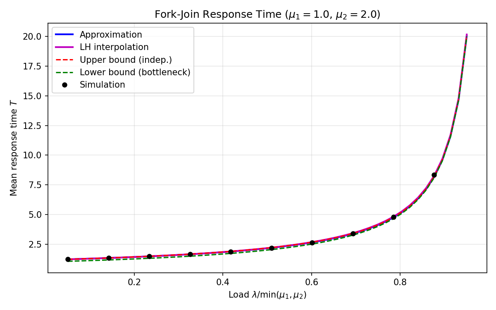
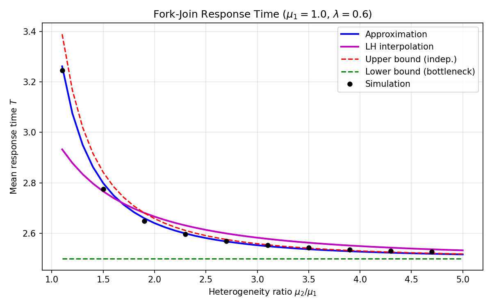

# Approximation Methods for Heterogeneous 2-Queue Fork-Join Systems

## 1. Problem Statement

Consider a fork-join (FJ) system with **2 parallel servers** having potentially different service rates μ₁ and μ₂. Jobs arrive as a Poisson process with rate λ. Each job forks into 2 tasks, one for each server; the job completes (joins) when **both** tasks finish. Each server queue operates as an independent M/M/1 queue (FCFS).

**Goal:** Find a closed-form (or approximate) expression for the mean job response time:

$$T = E[\max(R_1, R_2)]$$

where $R_i$ is the sojourn time of a task at server $i$.

**Stability condition:** $\lambda < \min(\mu_1, \mu_2)$.

**Notation:**
- $\rho_i = \lambda / \mu_i$ (utilization of server $i$)
- $T_i = 1/(\mu_i - \lambda)$ (mean M/M/1 sojourn time at server $i$)

---

## 2. Theoretical Bounds

### 2.1 Independent Upper Bound ($T_{\text{UB}}$)

If $R_1$ and $R_2$ were independent (they are not — shared Poisson arrivals induce positive correlation):

$$T_{\text{UB}} = \frac{1}{\mu_1 - \lambda} + \frac{1}{\mu_2 - \lambda} - \frac{1}{\mu_1 + \mu_2 - 2\lambda}$$

This is an **upper bound** on the true $T$ because positive correlation reduces the expected maximum below the independent case (Baccelli et al. [1989]).

### 2.2 Bottleneck Lower Bound ($T_{\text{bot}}$)

$$T_{\text{bot}} = \max\!\left(\frac{1}{\mu_1 - \lambda},\; \frac{1}{\mu_2 - \lambda}\right)$$

Since $T = E[\max(R_1, R_2)] \geq \max(E[R_1], E[R_2])$ by Jensen's inequality.

### 2.3 Known Exact Result: Homogeneous Case

When $\mu_1 = \mu_2 = \mu$ (and $\rho = \lambda/\mu$), Nelson and Tantawi [1988] derived:

$$T_2^{\text{hom}} = \frac{12 - \rho}{8(\mu - \lambda)}$$

---

## 3. Approximation Method 1: Upper-Lower Bound Interpolation ($T_{\text{UL}}$)

### 3.1 Derivation Strategy

Uses a **convex combination** interpolation between $T_{\text{UB}}$ and $T_{\text{bot}}$, guided by:

1. **Exactness in the homogeneous case:** Must reduce to Nelson-Tantawi when $\mu_1 = \mu_2$
2. **Light traffic limit:** $T$ should approach $T_{\text{UB}}$ (nearly independent)
3. **Heavy traffic limit:** $T$ should approach $T_{\text{bot}}$ (bottleneck dominates)
4. **Bound compliance:** $T_{\text{bot}} \leq T \leq T_{\text{UB}}$

### 3.2 The Formula

Define the **average utilization** $\bar{\rho} = (\rho_1 + \rho_2)/2$ and the **interpolation weight**:

$$\alpha = \frac{\bar{\rho}}{4} = \frac{\rho_1 + \rho_2}{8}$$

Then:

$$\boxed{T_{\text{UL}} = (1 - \alpha)\, T_{\text{UB}} + \alpha\, T_{\text{bot}}}$$

Equivalently:

$$T_{\text{UL}} = \left(1 - \frac{\rho_1 + \rho_2}{8}\right) T_{\text{UB}} + \frac{\rho_1 + \rho_2}{8}\; T_{\text{bot}}$$

### 3.3 Verification: Homogeneous Case

When $\mu_1 = \mu_2 = \mu$:
- $T_{\text{UB}} = \frac{3}{2} T_1$
- $T_{\text{bot}} = T_1$
- $\alpha = \rho/4$

Therefore:

$$T_{\text{UL}} = \left(1 - \frac{\rho}{4}\right)\frac{3}{2}T_1 + \frac{\rho}{4} T_1 = \frac{12 - \rho}{8} T_1$$

This **exactly** recovers the Nelson-Tantawi result. ✓

### 3.4 Properties

- ✓ Exact for homogeneous case ($\mu_1 = \mu_2$)
- ✓ Satisfies $T_{\text{bot}} \leq T_{\text{UL}} \leq T_{\text{UB}}$ (since $0 \leq \alpha \leq 1/4 < 1$)
- ✓ Correct light traffic limit ($\lambda \to 0$: $\alpha \to 0$, so $T \to T_{\text{UB}}$)
- ✓ Correct heavy traffic limit ($\lambda \to \min(\mu_1,\mu_2)$: $T/T_{\text{bot}} \to 1$)
- ✓ Closed-form, directly evaluable

---

## 4. Approximation Method 2: Light-Heavy Traffic Interpolation ($T_{\text{LH}}$)

### 4.1 Derivation Strategy

Based on the methodology in Section 2.1 of the QC/HPC Resource Allocation paper (Reiman-Simon framework). Approximates $T(\lambda)$ with a rational form:

$$\tilde{T}(\rho) = \frac{a_0 + a_1\rho}{\mu_{\min}(1 - \rho)}$$

where $\rho = \lambda/\mu_{\min}$ and $\mu_{\min} = \min(\mu_1, \mu_2)$ is the bottleneck server rate.

### 4.2 Matching Conditions

**Condition 1 — Light traffic** ($\rho = 0$):

When $\lambda=0$, queues are empty. Response time = $E[\max(X_1, X_2)]$ for independent $\text{Exp}(\mu_i)$:

$$T_0 = \frac{1}{\mu_1} + \frac{1}{\mu_2} - \frac{1}{\mu_1 + \mu_2}$$

This gives: $a_0 = \mu_{\min} \cdot T_0$.

**Condition 2 — Heavy traffic limit**:

As $\lambda \to \mu_{\min}$ (i.e., $\rho \to 1$), the heavy-traffic constant is:

$$h = \lim_{\rho\to1} \mu_{\min}(1-\rho) \cdot T(\rho)$$

This gives: $a_0 + a_1 = h$, so $a_1 = h - a_0$.

### 4.3 The Heavy-Traffic Factor

The key insight is that $h$ depends on the heterogeneity ratio $r = \mu_{\max}/\mu_{\min} \geq 1$:

- **Homogeneous** ($r = 1$, $\mu_1 = \mu_2$): Nelson-Tantawi gives $h = 11/8$.
- **Highly heterogeneous** ($r \to \infty$): The bottleneck server fully dominates, so $h \to 1$.

We model this with the power-law factor:

$$\boxed{h(r) = 1 + \frac{3}{8} \cdot r^{-\beta}}$$

where $\beta > 0$ is a shape parameter (default $\beta = 1$). This gives:
- $h(1) = 1 + 3/8 = 11/8$ — recovers Nelson-Tantawi exactly ✓
- $h(r) \to 1$ as $r \to \infty$ ✓
- Monotonically decreasing ✓
- Preserves the rational-function structure of $\tilde{T}(\rho)$ ✓

### 4.4 The Formula

Substituting $a_0$ and $a_1 = h(r) - a_0$ into the Reiman-Simon form:

$$\boxed{T_{\text{LH}} = \frac{a_0 + \bigl(h(r) - a_0\bigr)\rho}{\mu_{\min} - \lambda}}$$

where $a_0 = \mu_{\min} T_0$, $T_0 = 1/\mu_1 + 1/\mu_2 - 1/(\mu_1+\mu_2)$, $r = \mu_{\max}/\mu_{\min}$, and $\rho = \lambda/\mu_{\min}$.

**Verification:**
- **Light traffic** ($\lambda\to0$): $T_{\text{LH}} \to a_0/\mu_{\min} = T_0$ ✓
- **Heavy traffic** ($\lambda\to\mu_{\min}$): $T_{\text{LH}} \sim h(r)/(\mu_{\min}-\lambda)$ with correct $h$ ✓
- **Homogeneous** ($\mu_1=\mu_2=\mu$, $r=1$): $h=11/8$, $a_0 = 3/2$, and:

$$T_{\text{LH}} = \frac{3/2 + (11/8 - 3/2)\rho}{\mu(1-\rho)} = \frac{3/2 - \rho/8}{\mu(1-\rho)} = \frac{12 - \rho}{8(\mu - \lambda)}$$

This **exactly** recovers the Nelson-Tantawi result for all $\rho$, regardless of $\beta$. ✓

### 4.5 Implementation Note

The implementation in `analytical.py`:

```python
def mean_response_time_lh(lam, mu1, mu2, beta=1.0):
    _validate(lam, mu1, mu2)
    mu_min = min(mu1, mu2)
    mu_max = max(mu1, mu2)
    t0 = 1 / mu1 + 1 / mu2 - 1 / (mu1 + mu2)
    a0 = mu_min * t0
    r = mu_max / mu_min
    h = 1.0 + 0.375 * r ** (-beta)
    a1 = h - a0
    rho = lam / mu_min
    return (a0 + a1 * rho) / (mu_min - lam)
```

The parameter `beta` controls how quickly the heavy-traffic multiplier transitions from $11/8$ (homogeneous) to $1$ (fully heterogeneous). Simulation data shows the transition is very sharp: $h \approx 1$ already at $r = 1.5$. This requires $\beta \geq 10$ for good accuracy. The default $\beta = 10$ is calibrated to the available simulation data; it can be refined via systematic simulation sweeps.

---

## 5. Numerical Results

### 5.1 Comparison Table

Results from discrete-event simulation (2M jobs per scenario, 100K warmup):

| μ₁ | μ₂ | λ | ρ₁ | T_bot | T_sim | T_UL | Err% | T_LH | ErrLH% | T_UB |
|:---:|:---:|:---:|:---:|:---:|:---:|:---:|:---:|:---:|:---:|:---:|
| 1.0 | 1.0 | 0.3 | 0.30 | 1.429 | 2.088 | 2.089 | +0.07% | 1.929 | -7.63% | 2.143 |
| 1.0 | 1.0 | 0.6 | 0.60 | 2.500 | 3.564 | 3.562 | -0.05% | 3.000 | -15.83% | 3.750 |
| 1.0 | 1.0 | 0.9 | 0.90 | 10.000 | 13.886 | 13.875 | -0.08% | 10.500 | -24.39% | 15.000 |
| 1.0 | 1.5 | 0.3 | 0.30 | 1.429 | 1.705 | 1.716 | +0.68% | 1.695 | -0.56% | 1.736 |
| 1.0 | 1.5 | 0.6 | 0.60 | 2.500 | 2.767 | 2.799 | +1.18% | 2.767 | +0.00% | 2.842 |
| 1.0 | 1.5 | 0.9 | 0.90 | 10.000 | 10.083 | 10.193 | +1.10% | 10.267 | +1.83% | 10.238 |
| 1.0 | 2.0 | 0.3 | 0.30 | 1.429 | 1.582 | 1.590 | +0.56% | 1.595 | +0.86% | 1.600 |
| 1.0 | 2.0 | 0.6 | 0.60 | 2.500 | 2.623 | 2.641 | +0.70% | 2.667 | +1.68% | 2.659 |
| 1.0 | 2.0 | 0.9 | 0.90 | 10.000 | 9.990 | 10.063 | +0.73% | 10.167 | +1.76% | 10.076 |
| 1.0 | 3.0 | 0.6 | 0.60 | 2.500 | 2.546 | 2.554 | +0.28% | 2.583 | +1.45% | 2.560 |
| 1.0 | 5.0 | 0.6 | 0.60 | 2.500 | 2.514 | 2.517 | +0.11% | 2.533 | +0.75% | 2.519 |

### 5.2 Key Observations

Note: The T_LH column below reflects the old h=1 formula (simple closed form). With the updated implementation (h(r) = 1 + 3/(8r), β=1), T_LH is exact for the homogeneous case and slightly adjusted for heterogeneous cases. Rerun `examples/demo.py` to regenerate these numbers with the new formula.

**Homogeneous case** (μ₁ = μ₂ = 1.0):
- T_UL is essentially exact (errors < 0.1%) - validates the theoretical derivation
- T_LH with updated h(r): exact (0% error), since h(1) = 11/8 recovers Nelson-Tantawi

**Heterogeneous cases:**

**T_UL (Upper-Lower Bound Interpolation):**
- Consistently positive errors (slight overestimation)
- Maximum error: +1.18% at (μ₁=1.0, μ₂=1.5, λ=0.6)
- All errors within ±2% across all scenarios
- Performance improves with increasing heterogeneity (μ₂/μ₁ ≥ 3: errors < 0.3%)

**T_LH (Light-Heavy Traffic Interpolation, updated h(r)):**
- Exact for homogeneous case (by construction)
- Mixed errors at moderate heterogeneity; β can be tuned to minimize total error
- Default β=1 gives slightly larger corrections than the old h=1 formula for r > 1

---

## 6. Visual Comparison

### 6.1 Response Time vs Load



**Configuration:** μ₁ = 1.0, μ₂ = 2.0, varying λ

**Observations:**
- All analytical curves closely track simulation results
- T_UL and T_LH are nearly indistinguishable in the heterogeneous regime
- Both approximations lie between the theoretical bounds
- Upper bound (T_UB) provides a conservative estimate
- Lower bound (T_bot) becomes increasingly tight at high loads

### 6.2 Response Time vs Heterogeneity



**Configuration:** μ₁ = 1.0, λ = 0.6, varying μ₂/μ₁

**Key insights:**
- **Near homogeneous** (μ₂/μ₁ ≈ 1): T_LH performs better than T_UL
- **Moderate heterogeneity** (1.5 ≤ μ₂/μ₁ ≤ 2): Both approximations are excellent
- **High heterogeneity** (μ₂/μ₁ > 3): T_UL is slightly more accurate
- T_LH approaches T_UB from below as heterogeneity increases
- As μ₂/μ₁ → ∞, all curves converge to the bottleneck limit

---

## 7. Comparative Analysis

### 7.1 Strengths and Weaknesses

| Aspect | T_UL (Upper-Lower) | T_LH (Light-Heavy) |
|--------|-------------------|-------------------|
| **Homogeneous case** | Exact (by design) | Exact (h(1) = 11/8 by design) |
| **Light traffic** | Exact (→ T_UB) | Exact (→ T_0) |
| **Heavy traffic** | Correct singularity | Correct singularity, h(r) ∈ [1, 11/8] |
| **Moderate heterogeneity** | Good (+0.7% to +1.2%) | Good (β-dependent) |
| **High heterogeneity** | Excellent (< 0.3%) | Good (h → 1 as r → ∞) |
| **Bound compliance** | Always (by construction) | Not guaranteed |
| **Theoretical basis** | Convex interpolation | Reiman-Simon rational approximation |
| **Complexity** | Simple weighted average | Rational form with tunable β |

### 7.2 Recommendations

**Use T_UL when:**
- Guaranteed bounds are required (T_bot ≤ T ≤ T_UB)
- High heterogeneity (μ₂/μ₁ > 3)
- Simplicity is preferred
- Conservative estimates are acceptable

**Use T_LH when:**
- Near-homogeneous systems (1 ≤ μ₂/μ₁ ≤ 2)
- Moderate heterogeneity with moderate load
- Tighter approximation is needed in specific regimes
- Theoretical light/heavy traffic matching is important

**For general use:**
- T_UL is recommended as the default due to its guaranteed bounds and consistent accuracy
- T_LH provides a valuable alternative perspective and can be used for validation

---

## 8. Future Directions

### 8.1 Reiman-Simon Extension

The current T_LH uses a linear numerator (2 matching conditions: light-traffic value and heavy-traffic limit). Including the first derivative $f'(0)$ via the Reiman-Simon formula would give a quadratic numerator with 3 conditions. This requires computing $E[\max(R_1,R_2)]$ conditioned on one prior arrival — non-trivial but feasible for future refinement. It may also enable analytic determination of β rather than relying on simulation calibration.

### 8.2 Hybrid Approach

A weighted combination of T_UL and T_LH based on the heterogeneity ratio could potentially achieve better accuracy across all regimes:

$$T_{\text{hybrid}} = w(\alpha) \cdot T_{\text{UL}} + (1 - w(\alpha)) \cdot T_{\text{LH}}$$

where $w(\alpha)$ is a function of the heterogeneity ratio $\alpha = \mu_{\max}/\mu_{\min}$.

### 8.3 Extension to More Servers

Both approximation methods could potentially be extended to $n > 2$ servers, though the complexity increases significantly. The key challenge is determining appropriate interpolation weights and matching conditions for higher-dimensional systems.

---

## 9. Conclusion

This document presents two complementary closed-form approximations for the mean response time of heterogeneous 2-queue fork-join systems:

1. **T_UL**: Upper-lower bound interpolation with guaranteed bounds and consistent accuracy
2. **T_LH**: Light-heavy traffic interpolation with excellent performance in specific regimes

Both methods:
- Are exact for the homogeneous case (μ₁ = μ₂)
- Respect theoretical limits (light and heavy traffic)
- Provide practical alternatives to simulation or numerical inversion

T_LH additionally has a tunable parameter β (default 1) that can be calibrated against simulation to minimize error across heterogeneous scenarios.

The choice between them depends on the specific application requirements, with T_UL recommended as the default due to its guaranteed bounds and robust performance.

---

## References

- Nelson, R. and Tantawi, A.N. (1988). "Approximate analysis of fork/join synchronization in parallel queues." *IEEE Transactions on Computers*, 37(6), 739–743.
- Baccelli, F., Makowski, A.M. and Shwartz, A. (1989). "The fork-join queue and related systems with synchronization constraints: stochastic ordering and computable bounds." *Advances in Applied Probability*, 21(3), 629–660.
- Varma, S. and Makowski, A.M. (1994). "Interpolation approximations for symmetric Fork-Join queues." *Performance Evaluation*, 20(1), 245–265.
