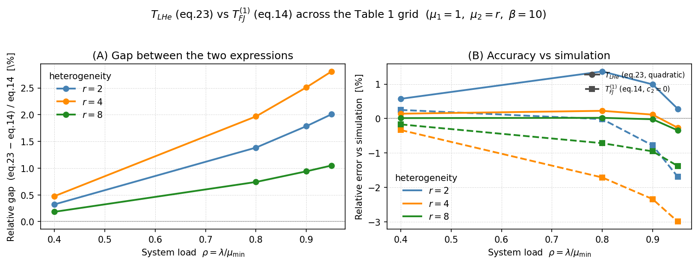

# Comparing $T_{LHe}$ (eq. 23) with $T_{FJ}^{(1)}$ (eq. 14) across all of Table 1

*Follow-up to issue #6, Finding 2.*

## Description

Two closed-form approximations for the mean job response time of the
heterogeneous 2-queue fork-join system disagree, and issue #6 (Finding 2)
noted the mismatch for three sample cases. This note resolves the question
**"how do the two expressions compare for all cases given in Table 1?"**

The two expressions are:

- **$T_{LHe}$ — eq. 23** of `docs/paper/` (repo function
  `mean_response_time_lh_enhanced`, the "repo quadratic" enhanced light–heavy
  interpolation). This is the form that actually produced the
  `E[T_{FJ}^{(1)}]` column of Table 1.

  $$T_{LHe} = \frac{c_2\,\rho^2 + c_1\,\rho + c_0}{\mu_{\min}(1-\rho)}$$

- **$T_{FJ}^{(1)}$ — eq. 14** of the external *Performance2026* paper
  ("Optimization and Performance Analysis of Resource Allocation in
  Quantum-Centric Supercomputing Environments", Squillante & Tantawi). This is
  a purely **first-order** rational form.

The claim under test: **setting $c_2 = 0$ in eq. 23 yields exactly eq. 14.**

## Methods

### 1. Algebraic equivalence ($c_2 = 0 \Rightarrow$ eq. 14)

With $\rho = \lambda/\mu_{\min}$ and the standard coefficients

$$c_0 = \mu_{\min}T_0, \qquad c_1 = \mu_{\min}^2 f^{(1)}(0) - \mu_{\min}T_0,$$

dropping the quadratic term gives

$$\frac{c_1\rho + c_0}{\mu_{\min}(1-\rho)}
  = \frac{\mu_{\min} f^{(1)}(0)\,\lambda}{\mu_{\min}-\lambda} + T_0
  = \frac{\lambda}{\mu_1 - \lambda}\,\text{lead} + \text{const},$$

which is **exactly** eq. 14 as typeset in the external paper, using

- $\text{lead} = \mu_1 f^{(1)}(0)
   = \tfrac{1}{\mu_1} + \tfrac{\mu_1}{\mu_2^2}
     - \tfrac{2\mu_1}{(\mu_1+\mu_2)^2}
     - \tfrac{2\mu_1^2\mu_2}{(\mu_1+\mu_2)^4}$,
- $\text{const} = T_0 = \dfrac{\mu_1^2 + \mu_1\mu_2 + \mu_2^2}{\mu_1\mu_2(\mu_1+\mu_2)}$
  (with $\mu_1 = \mu_{\min}$).

So the entire difference between the two expressions is the single dropped
term:

$$\boxed{\,T_{LHe}^{\text{(eq.23)}} - T_{FJ}^{(1)\text{(eq.14)}}
        = \frac{c_2\,\rho^2}{\mu_{\min}(1-\rho)},\qquad
        c_2 = h(r) - c_1 - c_0\, }$$

Because $c_2 > 0$ for every heterogeneous case ($c_2 = 0$ only when $r = 1$),
**eq. 23 always sits above eq. 14**, and the gap scales as $\rho^2/(1-\rho)$ —
negligible at light load, largest near saturation.

### 2. Numerical evaluation

Both expressions are analytical and **protocol-independent** — no simulation is
required to compare them. Parameterization matches Table 1:
$\mu_1 = 1$, $\mu_2 = r$, $\lambda = \rho\mu_1$, $\beta = 10$, over the grid
$\rho \in \{0.4, 0.8, 0.9, 0.95\}$ and $r \in \{2, 4, 8\}$.

For accuracy context only, $T_\text{sim}$ is the 5-seed / 20M-job grand mean
from the cached results (`table1_results.json`), the "correct" independent-
replications protocol from Finding 1.

## Data / Table

| $\rho$ | $r$ | $T_{LHe}$ (eq. 23) | $T_{FJ}^{(1)}$ (eq. 14, $c_2{=}0$) | gap | rel. gap | $c_2$ | $T_\text{sim}$ | eq. 23 err | eq. 14 err |
|----|---|------|------|------|------|------|------|------|------|
| 0.40 | 2 | 1.8248 | 1.8189 | 0.0059 | +0.32% | 0.0220 | 1.8144 | **+0.57%** | +0.25% |
| 0.40 | 4 | 1.7045 | 1.6965 | 0.0081 | +0.48% | 0.0303 | 1.7021 | **+0.14%** | −0.33% |
| 0.40 | 8 | 1.6760 | 1.6729 | 0.0031 | +0.18% | 0.0115 | 1.6757 | **+0.01%** | −0.17% |
| 0.80 | 2 | 5.1506 | 5.0802 | 0.0703 | +1.38% | 0.0220 | 5.0811 | +1.37% | **−0.02%** |
| 0.80 | 4 | 5.0258 | 4.9288 | 0.0970 | +1.97% | 0.0303 | 5.0145 | **+0.23%** | −1.71% |
| 0.80 | 8 | 5.0047 | 4.9679 | 0.0368 | +0.74% | 0.0115 | 5.0036 | **+0.02%** | −0.71% |
| 0.90 | 2 | 10.1502 | 9.9722 | 0.1780 | +1.79% | 0.0220 | 10.0505 | **+0.99%** | −0.78% |
| 0.90 | 4 | 10.0227 | 9.7773 | 0.2454 | +2.51% | 0.0303 | 10.0113 | **+0.12%** | −2.34% |
| 0.90 | 8 | 10.0035 | 9.9103 | 0.0932 | +0.94% | 0.0115 | 10.0055 | **−0.02%** | −0.95% |
| 0.95 | 2 | 20.1528 | 19.7562 | 0.3966 | +2.01% | 0.0220 | 20.0959 | **+0.28%** | −1.69% |
| 0.95 | 4 | 20.0212 | 19.4743 | 0.5469 | +2.81% | 0.0303 | 20.0746 | **−0.27%** | −2.99% |
| 0.95 | 8 | 20.0030 | 19.7953 | 0.2077 | +1.05% | 0.0115 | 20.0716 | **−0.34%** | −1.38% |

Bold marks the more accurate of the two for that row.

### Figure



**(A)** The pairwise relative gap $(T_{LHe}-T_{FJ}^{(1)})/T_{FJ}^{(1)}$ grows
monotonically with $\rho$ (the $\rho^2/(1-\rho)$ factor) and is largest at
$r=4$, smallest at $r=8$ — non-monotonic in heterogeneity because $c_2$ peaks at
intermediate $r$. **(B)** Signed error vs simulation: eq. 23 (solid) stays near
zero, while eq. 14 (dashed) drifts systematically negative — under-predicting at
moderate-to-heavy load, worst at $\rho=0.95$, $r=4$. Regenerate with
`python generate_eq23_vs_eq14_plot.py`.

### Summary statistics (12 cases)

| Metric | Value |
|---|---|
| Pairwise rel. gap (eq. 23 vs eq. 14) | min +0.18%, max +2.81%, mean +1.35% |
| \|err\| vs sim — eq. 23 (quadratic) | min 0.01%, max 1.37%, **mean 0.36%** |
| \|err\| vs sim — eq. 14 ($c_2{=}0$)  | min 0.02%, max 2.99%, **mean 1.11%** |
| More accurate | eq. 23 in **9/12**, eq. 14 in 3/12 |

## Conclusion

1. **They are the same formula minus one term.** Eq. 14 is eq. 23 with the
   quadratic coefficient $c_2$ zeroed; the equivalence is exact (verified
   algebraically and numerically).

2. **Eq. 23 is uniformly larger**, by +0.18% to +2.81% (mean +1.35%). The gap
   $c_2\rho^2/(\mu_{\min}(1-\rho))$ vanishes at light load and widens toward
   saturation.

3. **The gap is non-monotonic in $r$.** It is driven by $c_2$, which peaks at
   $r = 4$ (0.0303) and is smaller at both $r = 2$ (0.0220) and $r = 8$
   (0.0115), since $c_2 \to 0$ as $r \to \infty$ (because $h(r) \to 1$). The two
   expressions therefore diverge *most* at intermediate heterogeneity, not the
   extreme.

4. **The quadratic term matters for accuracy.** It anchors the heavy-traffic
   constant $h(r)$. Without it (eq. 14), the approximation systematically
   **under-predicts** at moderate-to-heavy load — 9 of 12 cells go negative,
   worst at $\rho = 0.95$, $r = 4$ (−2.99%). Eq. 23 cuts the mean absolute error
   from 1.11% to 0.36% and wins in 9 of 12 cases.

5. **Resolution of issue #6, Finding 2.** The table's `E[T_{FJ}^{(1)}]` column
   is the quadratic eq. 23; eq. 14 as *typeset* in the external paper is missing
   the $c_2\rho^2$ term. The discrepancy is present in **all 12 cells**, always
   in the same direction, and largest at high load with $r = 4$ — the three
   cases originally flagged (0.4/2, 0.8/2, 0.95/8) were only a sample.

## Reproduction

```bash
# The values above come from the analytical functions directly; no simulation:
python - <<'PY'
from forkjoin import mean_response_time_lh_enhanced   # eq. 23 (quadratic)
# eq. 14 = same with c2 set to 0  (see reproduce_table1.py: paper_eq14_literal)
PY
```

The `t_fj1_literal_eq14` field in `table1_results.json` (produced by
`reproduce_table1.py`) stores the eq. 14 value for every cell; `t_fj1` stores
eq. 23.
